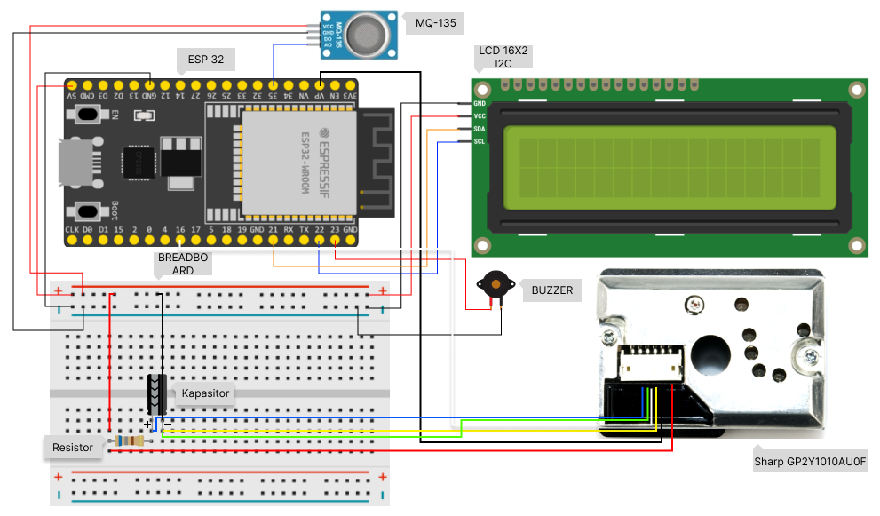

# Petunjuk Penggunaan `esp32_mqtt_mq135_GP2Y1010AU0F`

gunakan Arduino IDE untuk mengembangkan kode ini degan lebih mudah

## Langkah-langkah Instalasi

1. **Setup board ESP 32 pada Arduino IDE:**

    - Untuk tutorial lengkap buka situs [situs resmi randomnerdtutorials](https://randomnerdtutorials.com/installing-the-esp32-board-in-arduino-ide-windows-instructions/).

2. **Clone Repositori:**

    - Clone repositori ini ke komputer Anda pada `C:\Users\your_users\Documents\Arduino` menggunakan perintah:
        ```bash
        git clone <URL_REPOSITORI>
        ```
    - Buka folder tersebut menggunakan Arduino IDE.
    - Mungkin kamu harus menyamakan nama folder dengan nama file arduino (.ino).

3. **Instal Library:**

    - install library yang diperlukan, library diawali dengan `#include`.

## Catatan Tambahan

-   Jika Anda mengalami masalah, pastikan semua dependensi telah terinstal dengan benar dan konfigurasi lingkungan sesuai.
-   jika ada pertanyaan kirim email ke ditaputra1296@gmail.com
-   Repository ini terhubung dengan [react_simple_semi_realtime](https://github.com/DitaPutraPratama/react_simple_semi_realtime) dan [express_mqtt_mysql](https://github.com/DitaPutraPratama/express_mqtt_mysql) agar menjadi 1 proyek IoT


